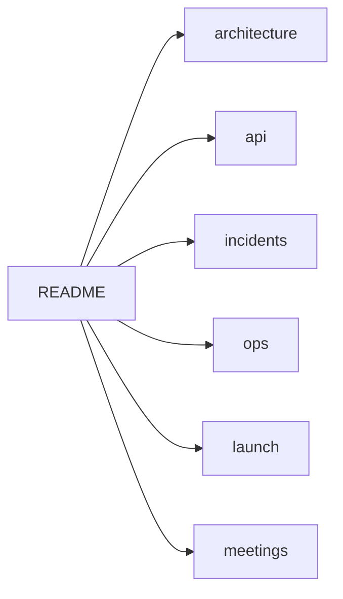

# Roastellar — ArenaX Documentation

Central documentation repository for the Roastellar organization and the ArenaX gaming platform.

## About ArenaX

ArenaX is a competitive gaming tournament platform where players compete, climb leaderboards, and earn NFT-based rewards on-chain.

## Documentation Structure

## Index

### Architecture

| Document | Content |
|----------|---------|
| [Overview](architecture/overview.md) | System context, components, environments |
| [Backend](architecture/backend.md) | Services, data model, failure handling |
| [Smart Contracts](architecture/smart-contracts.md) | NFT, marketplace, bridge, treasury |

### API

| Document | Content |
|----------|---------|
| [API Reference](api/overview.md) | Endpoint catalog, errors, rate limits |
| [Wallet Flow](api/flows/wallet-flow.md) | Challenge/signature authentication |
| [NFT Reward Flow](api/flows/nft-reward-flow.md) | Reward minting and distribution |
| [Tournament Flow](api/flows/tournament-flow.md) | Tournament lifecycle and scoring |
| [Bridge Flow](api/flows/bridge-flow.md) | Cross-chain asset settlement |

### Incidents

| Document | Severity |
|----------|----------|
| [IR-0042 Reward Mint Failure](incidents/reward-mint-failure.md) | P1 |
| [IR-0047 Leaderboard Inconsistency](incidents/leaderboard-inconsistency.md) | P2 |
| [IR-0051 Wallet Login Issue](incidents/wallet-login-issue.md) | P2 |

### Operations

| Document | Content |
|----------|---------|
| [Deployment Guide](ops/deployment-guide.md) | Environments, pipelines, deploys |
| [Monitoring Guide](ops/monitoring-guide.md) | Metrics, alerts, SLOs, on-call |
| [Rollback Procedure](ops/rollback-procedure.md) | Failure runbooks |

### Launch

| Document | Content |
|----------|---------|
| [Launch Checklist](launch/launch-checklist.md) | Pre-launch items with owners |
| [Release Notes](launch/release-notes.md) | v1.0.0 notes |
| [Version History](launch/version-history.md) | Release timeline and policy |

### Meetings

| Document | Content |
|----------|---------|
| [Meeting Notes](meetings/meeting-notes.md) | Decisions and action items |

## Related Repositories

- [GameBackend](https://github.com/roastellar-org/GameBackend) — backend API and smart contracts
- [DevOps](https://github.com/roastellar-org/DevOps) — infrastructure, CI/CD, monitoring
- [Frontend](https://github.com/roastellar-org/Frontend) — web client

## Status

Launch preparation. v1.0.0 targeted for 2026-08-01 — see the [launch checklist](launch/launch-checklist.md).
