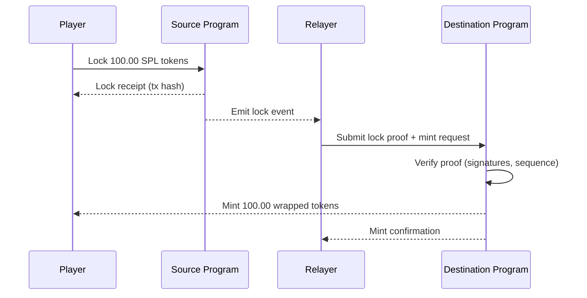

# Asset Bridge Flow

Cross-chain settlement of ArenaX rewards via the Asset Bridge program.

## Model

Lock-and-mint on the source chain, burn-and-release on the destination:

```mermaid
graph LR
    subgraph Source Chain (Solana)
        S[Source Program]
    end
    subgraph Destination Chain
        D[Destination Program]
    end
    U[User] -->|lock SPL tokens| S
    S -->|relay proof| D
    D -->|mint wrapped tokens| U
```

## Sequence



## Return Flow

1. Player burns wrapped tokens on the destination chain.
2. Burn event relayed to the source chain.
3. Source program releases the original locked tokens.

## Components

| Component | Responsibility |
|-----------|----------------|
| Source Program | Lock/release, custody of wrapped assets |
| Destination Program | Mint/burn wrapped assets |
| Relayer | Observes events, submits proofs |
| Sequence Registry | Prevents double-relay of the same lock |

## Security Considerations

- Relayer signatures verified on-chain; multisig relayers planned
- Sequence numbers prevent replay attacks
- Liquidity caps per asset to bound worst-case exposure
- Bridge contract will be audited before mainnet

## Known Limits

- Currently Solana-only; additional chains are planned after launch
- Bridge fees: 0.1% of transferred amount, routed to the treasury

## Related

- [Smart Contract Architecture](../architecture/smart-contracts.md)
- [API Reference](../overview.md)
