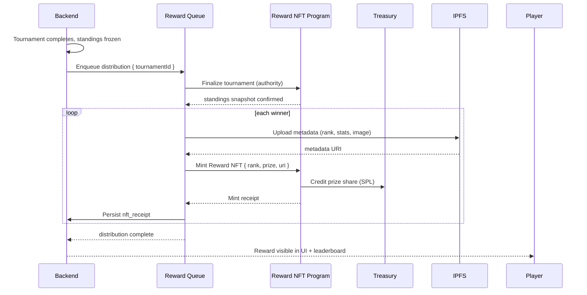

# NFT Reward Flow

End-to-end flow of how tournament winners receive Reward NFTs.

## Sequence



## Trigger Points

| Trigger | Source |
|---------|--------|
| Tournament finalization | Backend score ingestion |
| Manual re-run | `POST /rewards/distribute` (idempotent) |
| Retry after failure | Reward queue with exponential backoff |

## Idempotency

Each distribution is keyed by `distribution_id`:

1. Backend checks for an existing receipt row before minting.
2. On-chain calls include a unique memo per winner.
3. Duplicate `POST /rewards/distribute` calls return the existing `distributionId`.

See [incidents/reward-mint-failure.md](../incidents/reward-mint-failure.md) for why this was added.

## Prize Structure

| Rank | Share | Example ($300 pool) |
|------|-------|---------------------|
| 1 | 50% | 150 |
| 2 | 30% | 90 |
| 3 | 20% | 60 |

Distribution decimals are truncated at 2 places; remainder accrues to the treasury.

## Metadata

```json
{
  "name": "ArenaX Open #118 — 1st Place",
  "symbol": "AXNFT",
  "description": "Reward NFT for 1st place in ArenaX Open #118",
  "attributes": [
    { "trait_type": "tournament", "value": "t-118" },
    { "trait_type": "rank", "value": "1" },
    { "trait_type": "prize", "value": "150.00" }
  ]
}
```

## Related

- [Smart Contract Architecture](../architecture/smart-contracts.md)
- [Incident IR-0042: Reward Mint Failure](../incidents/reward-mint-failure.md)
