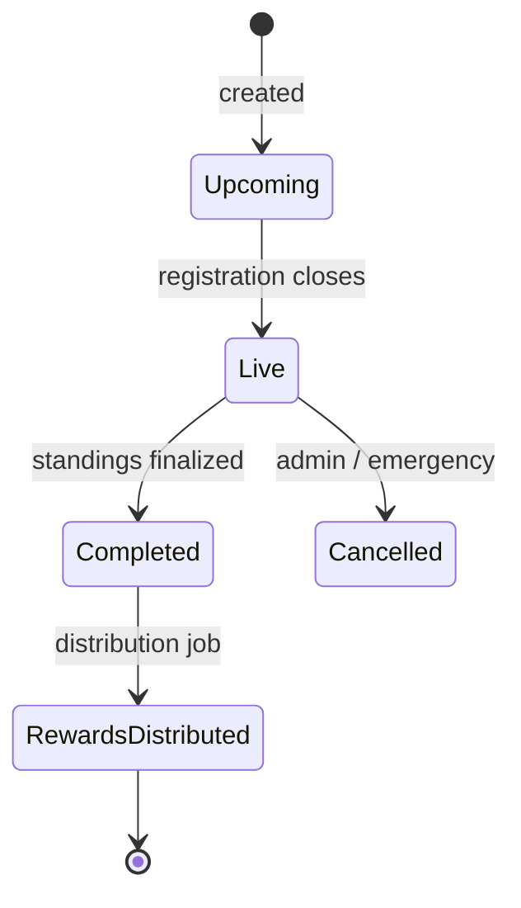
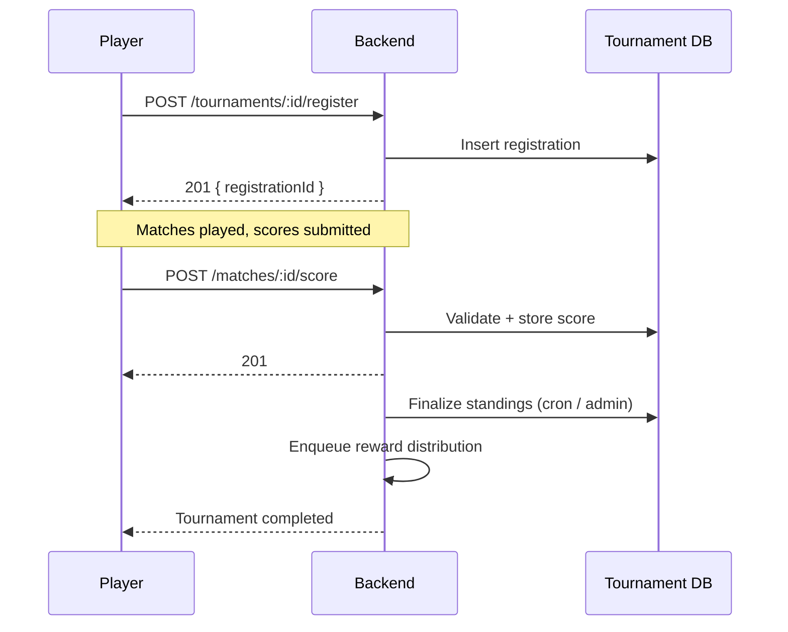

# Tournament Flow

Lifecycle of a tournament and the API calls that drive it.

## Lifecycle

## States

| State | Description |
|-------|-------------|
| `upcoming` | Accepting registrations |
| `live` | Matches in progress, score intake open |
| `completed` | Standings frozen, rewards pending |
| `cancelled` | Refunds processed, no rewards |
| `rewards_distributed` | Terminal state for completed tournaments |

## Sequence

## Registration Rules

- Entry fee deducted at registration time
- Refunds issued if the tournament is cancelled
- Max registrations enforced per tournament config
- One active registration per wallet per tournament (409 on duplicate)

## Score Intake

| Field | Validation |
|-------|------------|
| `matchId` | Must exist and be `live` |
| `score` | Numeric, within game bounds |
| `proofHash` | Optional replay/telemetry hash |
| `submittedBy` | Must be a registered participant |

Scores are accepted during `live` only. Late submissions are rejected with `409`.

## Finalization

1. Admin or scheduler calls finalize.
2. Standings are snapshotted atomically with the tournament state change.
3. The snapshot is the single source of truth for reward distribution and the leaderboard.

> The snapshot is critical: an inconsistent snapshot caused [incident IR-0047](../incidents/leaderboard-inconsistency.md).

## Related

- [API Reference](../overview.md)
- [NFT Reward Flow](nft-reward-flow.md)
- [Incident IR-0047: Leaderboard Inconsistency](../incidents/leaderboard-inconsistency.md)
