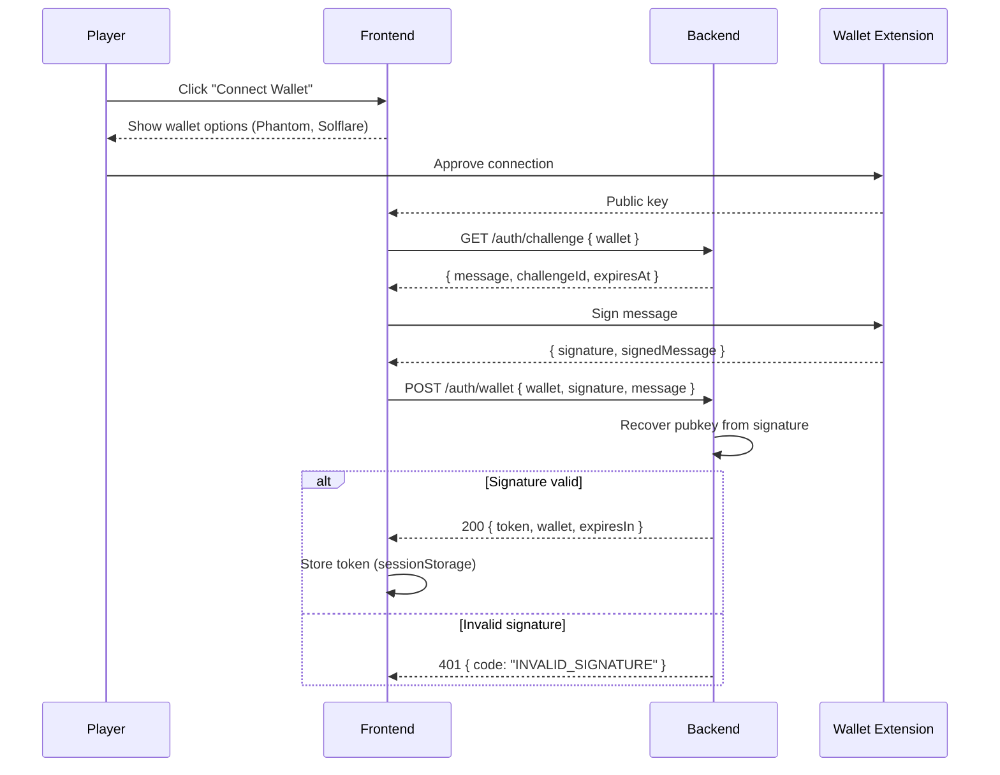

# Wallet Authentication Flow

How a player authenticates with the ArenaX platform using a Solana wallet.

## Sequence



## Challenge Message

The backend issues a challenge containing a nonce and expiry:

```json
{
  "message": "ArenaX authentication\nNonce: 7f3a...\nIssued: 2026-06-04T09:30:00Z\nExpires: 2026-06-04T09:35:00Z",
  "challengeId": "c-1188",
  "expiresAt": "2026-06-04T09:35:00Z"
}
```

Challenges expire after 5 minutes and are single-use.

## Signature Verification

1. Backend stores the `challengeId` server-side (Redis, TTL 5m).
2. On `POST /auth/wallet`, the backend verifies the message matches the issued challenge.
3. The wallet public key is recovered from the signature using Solana's `ed25519` verification.
4. If the recovered key equals `wallet`, a JWT is issued.

> **Note:** signature must be sent as a base58 string. Earlier clients sending raw byte arrays caused [incident IR-0051](../incidents/wallet-login-issue.md).

## Session

- JWT lifetime: 24 hours
- Refresh: silent re-authentication on token expiry
- Revocation: server-side blocklist for flagged wallets

## Error Cases

| Error | Cause | Handling |
|-------|-------|----------|
| `CHALLENGE_EXPIRED` | Challenge older than 5 minutes | Re-issue challenge |
| `INVALID_SIGNATURE` | Wrong wallet or tampered message | Show re-connect prompt |
| `WALLET_BLOCKED` | Wallet in sanctions blocklist | Blocked with support link |
| `RATE_LIMITED` | Too many attempts | Retry after reset window |

## Related

- [API Reference](../overview.md)
- [Incident IR-0051: Wallet Login Issue](../incidents/wallet-login-issue.md)
