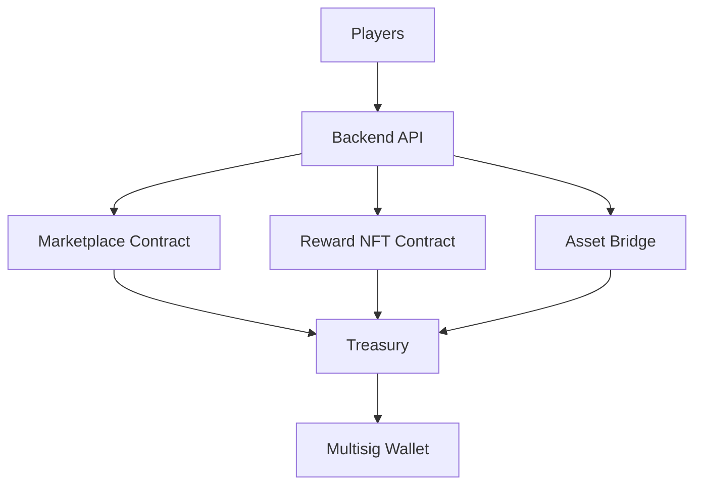

# ArenaX Architecture

High-level architecture of the ArenaX on-chain reward system.

## Overview

ArenaX settles tournament rewards on-chain using a suite of Solana programs. The backend orchestrates tournaments and payout flows; the on-chain layer handles reward issuance, trading, and treasury custody.

## On-Chain Components

### Reward NFT Contract

Mints a unique NFT for each tournament winner. The NFT encodes tournament metadata, rank, and prize amount.

- Metadata: tournament ID, rank, prize share
- Mint authority: ArenaX backend (admin wallet)
- Transferable: yes

### Marketplace Contract

Allows players to trade Reward NFTs. The marketplace takes a small fee on each sale, routed to the treasury.

- Listing and offer matching
- Protocol fee: 2%
- Payout: seller + treasury

### Asset Bridge

Transfers wrapped assets between chains, enabling cross-chain reward settlement for future tournament regions.

- Supported chains: Solana (initial)
- Wrapped asset standard: SPL tokens

### Treasury

Custody contract holding platform funds, marketplace fees, and unclaimed rewards.

- Withdrawals require multisig approval
- Fees from the marketplace flow into the treasury

## Diagram

## Flows

1. **Reward issuance** — backend triggers mint after tournament completion.
2. **Trading** — winners list NFTs on the marketplace; buyers purchase with SPL tokens.
3. **Settlement** — fees accrue to the treasury, withdrawable by multisig.

## Status

Contracts are under development on Solana devnet. Mainnet deployment is scheduled with the v1.0 launch.
