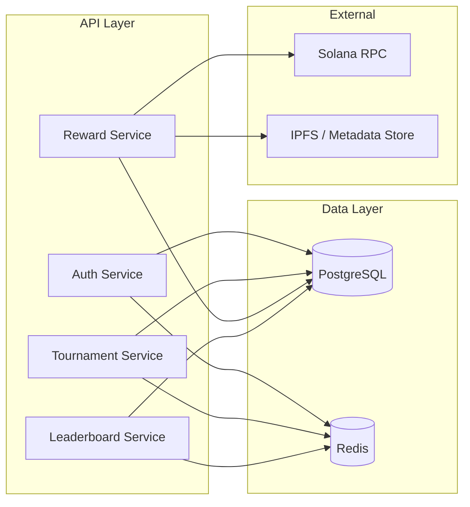
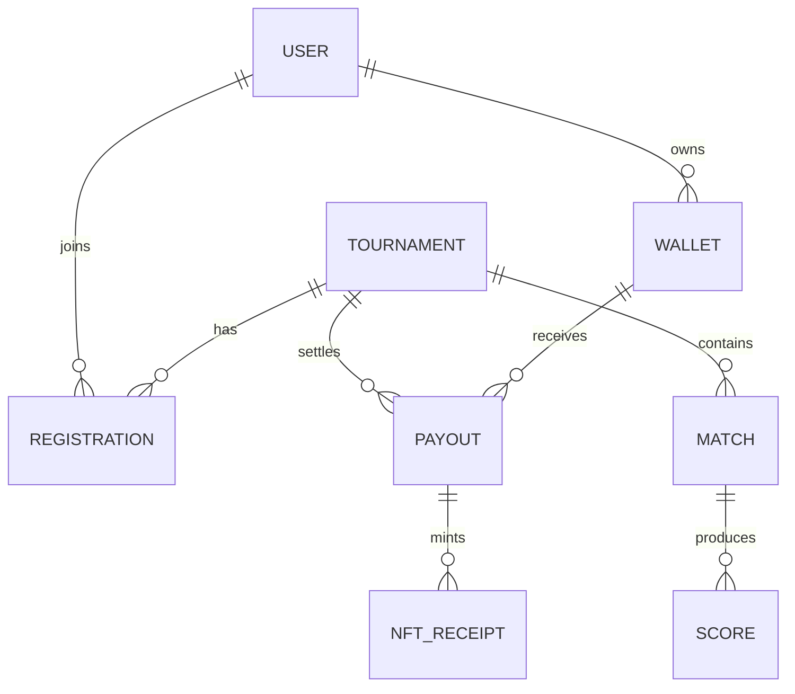

# Backend Architecture

Architecture of the ArenaX backend service. Source lives in the [GameBackend](https://github.com/roastellar-org/GameBackend) repository.

## Service Overview

## Technology Stack

- **Runtime:** Node.js 20 + TypeScript
- **API:** Express (REST)
- **Database:** PostgreSQL 16 (primary), Redis 7 (cache/queues)
- **Blockchain:** Solana Web3.js, on-chain programs in `contracts/`
- **Metrics:** prom-client, exposed at `/metrics`

## Module Layout

| Module | Responsibility |
|--------|----------------|
| `auth` | Wallet challenge/verification, JWT issuance |
| `tournaments` | Tournament lifecycle, registrations, score intake |
| `rewards` | Payout orchestration, idempotent distribution |
| `leaderboard` | Aggregated rankings and winnings |
| `wallet` | Wallet address utilities and signature helpers |

## Database Model

Key tables: `users`, `wallets`, `tournaments`, `registrations`, `matches`, `scores`, `payouts`, `nft_receipts`.

## Reward Distribution

The reward flow spans both backend and on-chain logic. See [api/flows/nft-reward-flow.md](../api/flows/nft-reward-flow.md) for the end-to-end sequence, and [smart-contracts.md](smart-contracts.md) for the on-chain component.

## Failure Handling

- **Idempotency:** reward distributions keyed by `distribution_id` (see [incidents/reward-mint-failure.md](../incidents/reward-mint-failure.md))
- **Retries:** exponential backoff for RPC calls
- **Circuit breaker:** on RPC provider health
- **Queues:** Redis-backed job queue for minting and leaderboard refresh

## Related

- [Architecture Overview](overview.md)
- [Smart Contract Architecture](smart-contracts.md)
- [API Reference](../api/overview.md)
