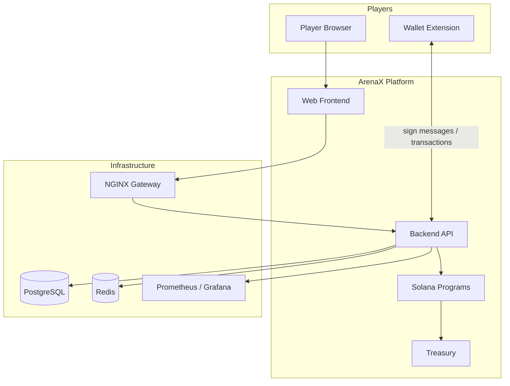
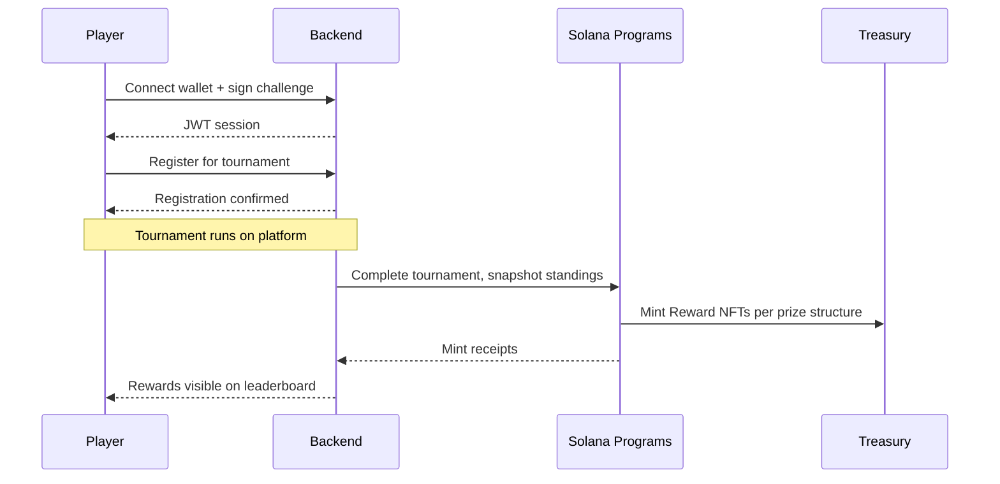

# ArenaX Architecture Overview

System-level view of the ArenaX platform: what it is, which components exist, and how they interact.

## System Context

## Components

| Component | Responsibility | Repository |
|-----------|---------------|------------|
| Web Frontend | Tournament hub, wallet connect, leaderboard UI | Frontend |
| Backend API | Auth, tournaments, rewards orchestration, leaderboards | [GameBackend](https://github.com/roastellar-org/GameBackend) |
| Reward NFT Contract | Mint winners' NFTs | GameBackend `contracts/` |
| Marketplace Contract | Trading of reward NFTs | GameBackend `contracts/` |
| Asset Bridge | Cross-chain reward settlement | GameBackend `contracts/` |
| Treasury | Custody of fees and unclaimed rewards | GameBackend `contracts/` |
| NGINX | TLS termination, reverse proxy | [DevOps](https://github.com/roastellar-org/DevOps) |
| PostgreSQL | Primary data store | [DevOps](https://github.com/roastellar-org/DevOps) |
| Redis | Session cache, queue buffers | [DevOps](https://github.com/roastellar-org/DevOps) |
| Prometheus / Grafana | Metrics and dashboards | [DevOps](https://github.com/roastellar-org/DevOps) |

## Core Flows

## Environments

| Environment | Purpose | Deployed By |
|-------------|---------|-------------|
| Staging | Integration testing | CI on `main` pushes |
| Production | Player-facing | CI on version tags |

See [ops/deployment-guide.md](../ops/deployment-guide.md) for environment details.

## Related Documents

- [Backend Architecture](backend.md)
- [Smart Contract Architecture](smart-contracts.md)
- [API Reference](../api/overview.md)
