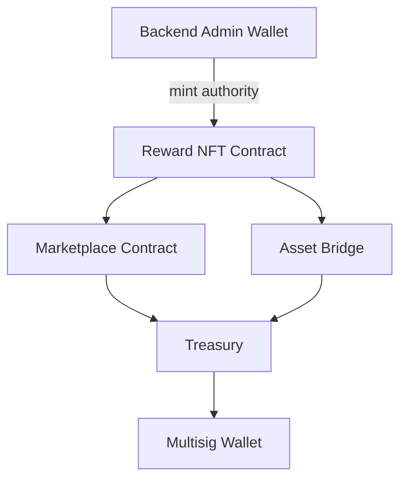
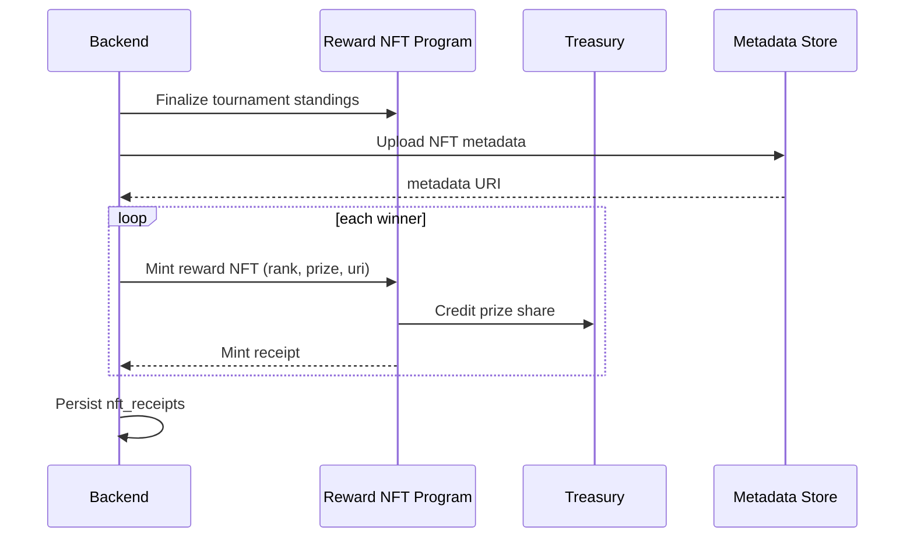

# Smart Contract Architecture

On-chain architecture of ArenaX on Solana. Programs are developed in `contracts/` within the [GameBackend](https://github.com/roastellar-org/GameBackend) repository.

## On-Chain Components

### Reward NFT Contract

Mints a unique NFT for each tournament winner.

| Field | Description |
|-------|-------------|
| Tournament ID | Source tournament |
| Rank | Final standing position |
| Prize share | Awarded amount in SPL tokens |
| Metadata URI | IPFS-hosted metadata (image, stats) |

- Mint authority: backend admin wallet
- Transferable: yes, via marketplace or direct

### Marketplace Contract

Enables trading of Reward NFTs.

- Listings with fixed price
- Offer matching and escrow
- Protocol fee: 2%, routed to treasury

### Asset Bridge

Wraps and transfers assets across chains.

- Solana mainnet first, additional chains planned
- Lock-and-mint / burn-and-release model
- See [api/flows/bridge-flow.md](../api/flows/bridge-flow.md)

### Treasury

Custody contract for platform funds.

- Sources: marketplace fees, unclaimed rewards, bridge fees
- Withdrawals require multisig approval (3-of-5)

## Reward Mint Sequence

## Security Model

- Programs are audited before mainnet
- Admin keys stored in HSMs; on-chain authority rotated quarterly
- Multisig threshold enforced for treasury withdrawals

## Related

- [Architecture Overview](overview.md)
- [NFT Reward Flow](../api/flows/nft-reward-flow.md)
- [Bridge Flow](../api/flows/bridge-flow.md)
