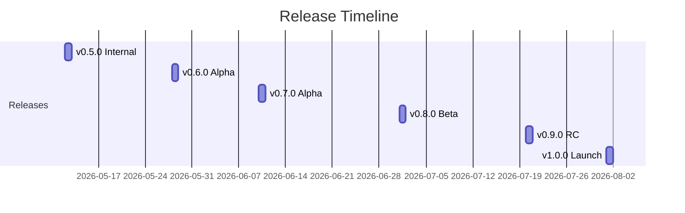

# Version History

Release history of the ArenaX platform. Detailed notes in [release-notes.md](release-notes.md).

## Releases

| Version | Date | Type | Highlights |
|---------|------|------|------------|
| **v1.0.0** | 2026-08-01 | Public launch | Wallet auth, tournaments, NFT rewards, leaderboard, marketplace |
| v0.9.0 | 2026-07-20 | Release candidate | Marketplace beta, rate limiting, audit fixes |
| v0.8.0 | 2026-07-01 | Beta | Reward distribution hardening (idempotency, RPC failover) |
| v0.7.0 | 2026-06-10 | Alpha | Leaderboard v1, tournament scoring API |
| v0.6.0 | 2026-05-28 | Alpha | Wallet authentication, challenge flow |
| v0.5.0 | 2026-05-12 | Internal | Project scaffolding, CI/CD baseline |

## Versioning Policy

- **Semantic versioning** (`major.minor.patch`)
- `v*` tags trigger production deploys (see [deployment guide](../ops/deployment-guide.md))
- Pre-1.0: minor versions may include breaking changes; patch versions are backward compatible

## Release Cadence

## Upcoming

| Version | Target | Scope |
|---------|--------|-------|
| v1.1.0 | Q3 2026 | Bridge multi-chain, auction support |
| v1.2.0 | Q4 2026 | Team tournaments, seasonal leaderboard |

## Support

- Security fixes: backported to the last two minor versions
- The current release is always `latest` on GHCR

See [release-notes.md](release-notes.md) for the latest release details.
