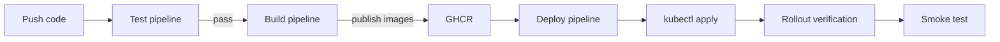

# Deployment Guide

How ArenaX is deployed to staging and production. Infrastructure and CI/CD live in the [DevOps](https://github.com/roastellar-org/DevOps) repository.

## Environments

| Environment | Domain | Deployed From | Trigger |
|-------------|--------|---------------|---------|
| Staging | `staging.arenax.gg` | `main` branch | Every push |
| Production | `arenax.gg` | version tags `v*` | Tag push or manual dispatch |

## Deployment Flow



## Steps

### 1. Image Build

The [build workflow](https://github.com/roastellar-org/DevOps/blob/main/.github/workflows/build.yml) builds and publishes:

- `ghcr.io/roastellar/arenax-backend:<sha>` / `:latest`
- `ghcr.io/roastellar/arenax-frontend:<sha>` / `:latest`

### 2. Deploy (Staging)

```bash
gh workflow run deploy.yml -f environment=staging
```

### 3. Deploy (Production)

```bash
git tag v1.0.0 && git push origin v1.0.0
```

### 4. Verification

The pipeline waits for rollouts, then you should verify:

```bash
kubectl get pods -n arenax
kubectl rollout status deployment/arenax-backend -n arenax
curl -s https://arenax.gg/api/health
```

## Manual Deploy (Emergency)

```bash
git pull origin main
kubectl apply -f kubernetes/ --recursive -n arenax
kubectl rollout status deployment/arenax-backend -n arenax --timeout=5m
```

## Database Migrations

Migrations run as a job before the backend rollout:

```bash
kubectl apply -f kubernetes/jobs/migrate.yaml -n arenax
kubectl wait --for=condition=complete job/db-migrate -n arenax --timeout=10m
```

## Rollback

If the deployment is unhealthy, follow the [Rollback Procedure](rollback-procedure.md).

## Health Checks

| Endpoint | Purpose |
|----------|---------|
| `GET /health` | Liveness/readiness for backend |
| `GET /healthz` | Readiness for frontend |

## Related

- [Monitoring Guide](monitoring-guide.md)
- [Rollback Procedure](rollback-procedure.md)
- [Architecture Overview](../architecture/overview.md)
