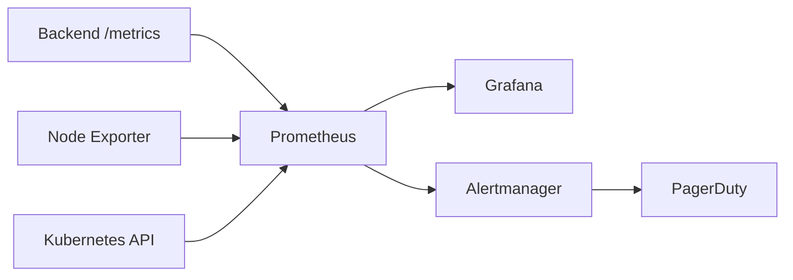

# Monitoring Guide

How ArenaX is monitored. Dashboards and configuration live in the [DevOps](https://github.com/roastellar-org/DevOps) repository under `monitoring/`.

## Stack

## Scrape Targets

| Target | Endpoint | Job |
|--------|----------|-----|
| Backend pods | `:9464/metrics` | `arenax-backend` |
| Nodes | `:9100/metrics` | `node-exporter` |
| API server | `/metrics` | `kubernetes-apiservers` |

## Dashboards

- **ArenaX Backend Overview** (`arenax-backend-overview`): request rate, p95/p99 latency, 5xx error rate, pod memory, restarts

Access: `https://grafana.arenax.gg` (SSO via GitHub org).

## Key Metrics

| Metric | Alert | Severity |
|--------|-------|----------|
| 5xx rate > 5% (10m) | `BackendHighErrorRate` | critical |
| `up == 0` (5m) | `InstanceDown` | critical |
| p95 latency > 1s (10m) | `HighRequestLatency` | warning |
| Disk usage > 85% (15m) | `DiskSpaceLow` | warning |
| CPU throttling > 25% (15m) | `CPUThrottlingHigh` | warning |
| Signature errors > threshold | `AuthErrorRateHigh` | warning |

See [alert-rules.yml](https://github.com/roastellar-org/DevOps/blob/main/monitoring/prometheus/alert-rules.yml).

## Incident Response

1. Alert fires → PagerDuty pages on-call (rotations in `#on-call` Slack).
2. Triage in Slack `#incidents`; create a postmortem in [incidents/](../incidents/).
3. Follow the [Rollback Procedure](rollback-procedure.md) if deployment-related.
4. Update the incident doc within 48h.

## Logging

- Structured JSON logs, shipped to the log aggregator (hosted Loki/Grafana Cloud)
- Retention: 30 days hot, 12 months cold
- Sensitive data (signatures, tokens) redacted at the source

## SLOs

| Metric | Target |
|--------|--------|
| Availability (30d) | 99.9% |
| Reward distribution within SLA | 95% within 15 min |
| p95 API latency | < 800ms |

## Related

- [Deployment Guide](deployment-guide.md)
- [Incidents](../incidents/reward-mint-failure.md)
