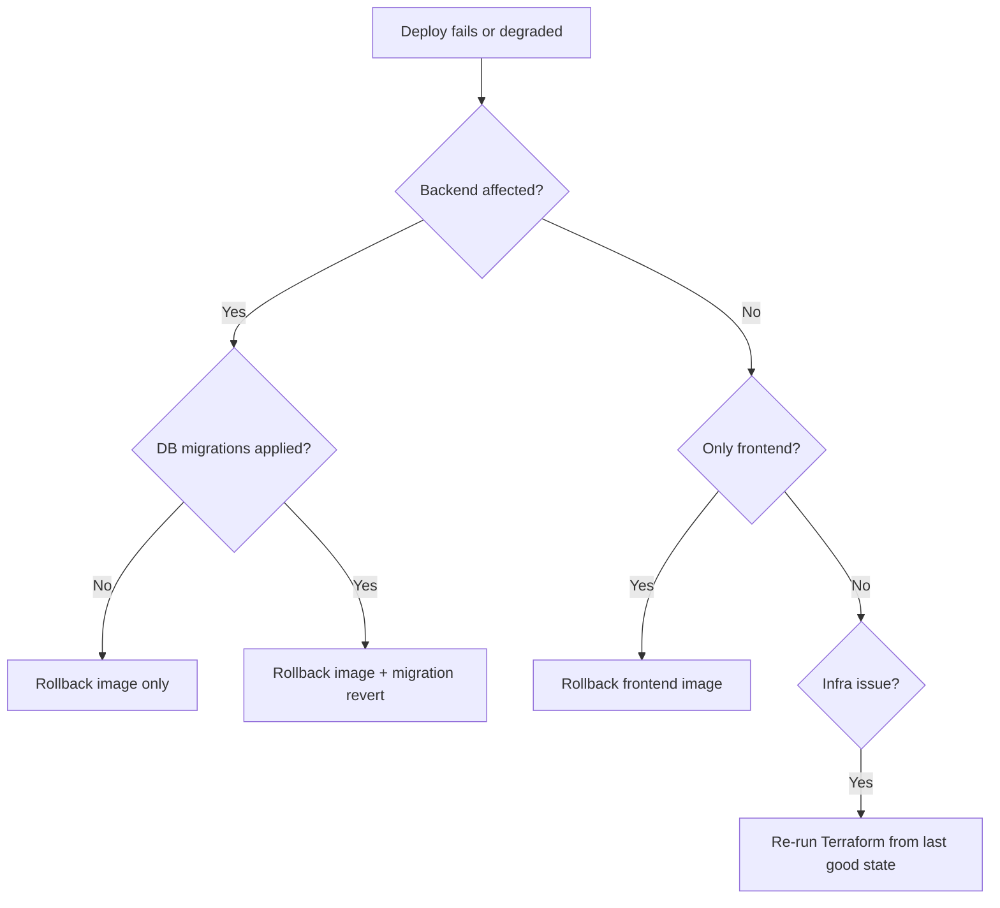

# Rollback Procedure

Runbook for reverting a bad deployment on ArenaX. Execute the steps that match the failure mode; stop as soon as service is healthy.

## Decision Tree



## Rolling Back the Backend Image

```bash
# Find the last known-good image tag (previous SHA or previous release tag)
kubectl -n arenax set image deployment/arenax-backend \
  backend=ghcr.io/roastellar/arenax-backend:<LAST_GOOD_SHA>

kubectl -n arenax rollout status deployment/arenax-backend --timeout=5m
kubectl -n arenax rollout history deployment/arenax-backend
```

To undo entirely to the previous revision:

```bash
kubectl -n arenax rollout undo deployment/arenax-backend
```

## Rolling Back the Frontend

```bash
kubectl -n arenax rollout undo deployment/arenax-frontend
```

## Migrations

Migrations are forward-only. If a migration has run:

1. Determine whether it was data-loss or schema-only.
2. For schema-only: deploy the code version that matches the previous schema.
3. For data-loss: restore the affected tables from the daily backup, then re-apply fixes.

> Never run `rollout undo` past a schema migration that code still expects — align code and schema versions.

## Compose (non-K8s environments)

```bash
# Revert compose images to last known-good tag
docker compose -f docker-compose.prod.yml pull <service>:<LAST_GOOD_TAG>
docker compose -f docker-compose.prod.yml up -d
```

## Verification After Rollback

```bash
curl -sf https://arenax.gg/api/health
kubectl -n arenax get pods | grep -v Running
kubectl -n arenax get events --sort-by=.lastTimestamp | tail -20
```

Confirm dashboards return to baseline: error rate, latency, restart count.

## Communication

- Announce in `#incidents` with severity and rollback SHA
- Post-mortem follows per [monitoring guide](monitoring-guide.md)

## Related

- [Deployment Guide](deployment-guide.md)
- [Monitoring Guide](monitoring-guide.md)
